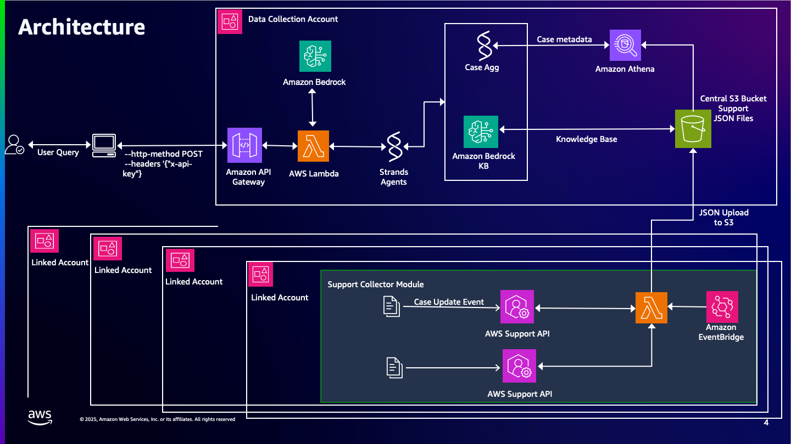

This solution optimizes AWS infrastructure and improves operational efficiencies through Agentic AI by delivering automated analysis and guided remediation. Built using the open-source Strands SDK from AWS, this solution provides complete flexibility and control over your AI implementation - you can use any LLM you prefer, whether it's Bedrock models, any model providers, or even local models like Ollama.

The solution provides access through APIs or a web interface, featuring specialized agents that deliver distinct capabilities. The architecture is completely serverless, running on Bedrock and Lambda for automatic scaling without infrastructure management. Most importantly, this is a 100% API-driven solution that can easily integrate with any platform you're already using, whether that's Slack or your own internal tools.

The Support Case Agent capability processes both structured and unstructured data from AWS support cases, performing numerical analysis using RAG and SQL agents for comprehensive operational insights. When dealing with support cases, the system handles two types of data: metadata (case ID, status, severity) for measurable statistical analysis, and conversation text for contextual understanding, providing both the story behind each case and statistical trends for data-driven decisions.

## Solution Architecture

The following diagram illustrates a multi-account structure with flexible AI agent orchestration.

The solution demonstrates how to build flexible, customizable AI applications using the open-source Strands SDK from AWS. The architecture showcases modularity - you can add new agents or enhance existing ones without disrupting the overall flow. The implementation follows the [Agents as Tools](https://strandsagents.com/latest/documentation/docs/user-guide/concepts/multi-agent/agents-as-tools/) architecture pattern from Strands.

**Key Architectural Components:**

**Entry Points and Integration:**
- Users interact through web interface or directly via API calls
- All requests funnel through Amazon API Gateway with API key security
- 100% API-driven design enables integration with any platform (Slack, internal tools, etc.)

**AI Agent Orchestration:**
- API Gateway triggers Lambda functions implementing multi-agents using Strands Agents SDK
- Orchestrator agent coordinates all specialized agents based on user prompts
- Two primary specialized agents for support cases:
  - **Numerical Analysis Agent**: Handles structured data queries using Athena SQL
  - **Knowledge Base Agent**: Processes unstructured data using RAG

**Data Flow and Processing:**
- Natural language queries are translated into precise Athena SQL via Bedrock LLM
- Support case metadata and Trusted Advisor data collected through AWS Support API
- Data stored in S3 and made queryable through Athena for unified multi-account view
- Orchestrator synthesizes responses from all agents into comprehensive answers

**Flexibility and Control:**
- Built on open-source [Strands SDK](https://strandsagents.com/latest/documentation/docs/) for complete customization
- LLM-agnostic design - use Bedrock, any model providers, or even [local models like Ollama](https://strandsagents.com/latest/documentation/docs/user-guide/concepts/model-providers/ollama/)
- Serverless architecture on Bedrock and Lambda for automatic scaling
- Modular design allows adding new capabilities without architectural changes

The Data Collection Account refers to the central account that contains the support data in an S3 bucket after downloading from all accounts in scope. The Linked accounts refer to any accounts other than the Data Collection Account that have AWS support data - AWS support cases, Trusted Advisor, or Health.

## Optira Components

This section outlines the key components of the Optira solution. 

### Optira Core

The solution has Optira Core that is deployed in a central Data Collection account. This contains core agents that can be deployed via CDK. It contains:
 - AI Agents powered by Amazon Bedrock and Strands SDK - running in central (Data Collection) account
 - Amazon Bedrock Knowledge Base
 - API Gateway that abstracts the AI agents
 - Extension to the Data Pipeline that updates metadata and Knowledge Base in the central account when the data collection S3 bucket is updated

The deployment process is detailed in the [Optira Core Deployment](./optira-core/README.md) guide, located in the `optira-core` subdirectory. This guide covers the steps to set up the required AWS resources.

### AWS Support Collector Module - Data Pipeline

The solution includes a data collection module to retrieve the necessary AWS support data.

The [Optira AWS Support Collection - Data Pipeline](./support_collector/README.md) guide, located in the `support_collector` subdirectory, outlines the steps to deploy the AWS Lambda functions and EventBridge resources required to collect and upload AWS Support Cases to an Amazon S3 bucket. This collected data can then be leveraged by Optira AI Agents to provide insights and remediations.

### Optira Web

Node.js React Web interface secured via Cognito. The architecture and deployment process is detailed in the [Optira Web Deployment](./optira-web/README.md) guide, located in the `optira-web` subdirectory. 

## Disclaimer

The code provided in this solution should be thoroughly tested and validated before deploying it in a production environment.

## Support

For technical questions and implementation guidance, please reach out to your AWS Technical Account Managers (TAMs) who can provide specialized assistance with this solution.

## License

This project is licensed under the MIT License.
